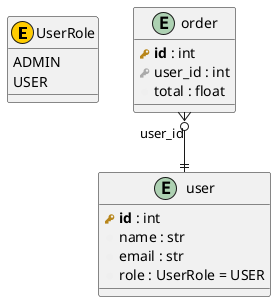

# 🗃️ erdify

[](https://pypi.org/project/erdify/)
[](https://pypi.org/project/erdify/)
[](https://opensource.org/licenses/MIT)
[](https://github.com/devsuit-berlin/erdify/actions/workflows/test.yml)
[](https://github.com/devsuit-berlin/erdify/actions/workflows/lint.yml)
[](https://github.com/astral-sh/ruff)
[](https://mypy-lang.org/)

> 🚀 Generate beautiful PlantUML Entity Relationship Diagrams from your SQLModel, SQLAlchemy, Django, Pydantic and dataclass models automatically!

**erdify** parses your model files using AST (Abstract Syntax Tree) and generates comprehensive ERD diagrams in PlantUML format. It supports SQLModel, SQLAlchemy 2.0, Django ORM, Pydantic and standard-library dataclasses. No database connection required!

## ✨ Features

- 📊 **Automatic ERD Generation** - Parse your models and generate PlantUML diagrams
- 🧬 **5 Frameworks** - SQLModel, SQLAlchemy 2.0 (`Mapped[...]`/`mapped_column()`), Django ORM, Pydantic and dataclasses
- 🔍 **AST-Based Parsing** - No imports needed, works with any valid Python code
- 🎯 **Zero Runtime Dependencies** - Uses only Python standard library
- 🔗 **Relationship Detection** - Automatically detects foreign keys and relationships
- 🔑 **Key Inference** - Optional `--infer-keys` derives PK/FK from field names for keyless models
- 🚫 **Exclude Patterns** - Filter out entities by class or table name with glob patterns
- 🎚️ **Source Filtering** - Restrict the diagram to specific model kinds with `--sources` (e.g. ORM tables only)
- 📦 **Inheritance Support** - Correctly resolves fields from base classes and mixins
- 🏷️ **Enum Support** - Includes enum definitions in the diagram
- 🔄 **Link Table Detection** - Identifies many-to-many association tables structurally (two FK columns that form the primary key), regardless of class name, including SQLAlchemy Core `Table()` association tables referenced via `relationship(secondary=...)`
- 🎨 **Beautiful Output** - Clean, readable PlantUML with proper styling

## 📦 Installation

### Using pip

```bash
pip install erdify
```

### Using uv

```bash
uv add erdify
```

### Using pipx (recommended for CLI usage)

```bash
pipx install erdify
```

### Using uvx (no installation needed)

```bash
# Run directly without installing
uvx erdify ./src/database -o erd.puml
```

## 🚀 Quick Start

### Command Line

```bash
# Generate ERD from a models directory
erdify ./src/database -o erd.puml

# With custom title
erdify ./src/models --title "My Database Schema" -o schema.puml

# Output to stdout
erdify ./src/database
```

### Python API

```python
from pathlib import Path
from erdify import parse_models_directory, generate_plantuml

# Parse your models
entities, enums = parse_models_directory(Path("./src/database"))

# Generate PlantUML
diagram = generate_plantuml(
    entities=entities,
    enums=enums,
    title="My Database ERD"
)

# Save or use the diagram
Path("erd.puml").write_text(diagram)
```

## 📖 Usage

### CLI Options

```bash
usage: erdify [-h] [-o OUTPUT] [--title TITLE] [--exclude [PATTERN ...]]
                    [--exclude-paths [PATTERN ...]] [--no-default-excludes]
                    [--sources [KIND ...]] [--infer-keys] [--django-raw-types]
                    [--no-enums] [--no-relationships] [-v]
                    input

Generate PlantUML ERD diagrams from SQLModel, SQLAlchemy, Django, Pydantic and dataclass models

positional arguments:
  input                 Directory containing model files (searches for models.py recursively)

options:
  -h, --help            show this help message and exit
  -o OUTPUT, --output OUTPUT
                        Output .puml file (default: stdout)
  --title TITLE         Diagram title (default: 'Database ERD')
  --exclude [PATTERN ...]
                        Glob patterns (case-sensitive) to exclude entities by
                        class name or table name, e.g. --exclude '*Link' audit_log
  --exclude-paths [PATTERN ...]
                        Glob patterns for models.py files to skip before parsing,
                        matched against the path relative to input or any path
                        segment, e.g. --exclude-paths migrations legacy
  --no-default-excludes
                        Do not auto-skip models.py under venv/site-packages/cache
                        dirs (.venv, site-packages, __pycache__, ...); scan them too
  --sources [KIND ...]  Restrict which model kinds become entities. Choices:
                        sqlmodel, sqlalchemy, django, dataclass, pydantic.
                        Default: all, e.g. --sources sqlmodel sqlalchemy for DB
                        tables only
  --infer-keys          For keyless models (Pydantic/dataclass), infer a primary
                        key from a field named 'id' and a foreign key from '<x>_id'
  --django-raw-types    For Django models, show original field names (CharField,
                        TextField) instead of mapped Python types (str, int)
  --no-enums            Skip enum definitions in output
  --no-relationships    Skip relationship lines in output
  -v, --version         show program's version number and exit
```

### Excluding Entities

Use `--exclude` to drop tables/entities from the diagram. Each pattern is a
case-sensitive [glob](https://docs.python.org/3/library/fnmatch.html) tested
against both the **class name** and the **table name** — an entity is excluded
if either matches. Any relationships pointing at an excluded entity are dropped
too, so no dangling lines remain.

```bash
# Exclude all link tables (class names ending in "Link")
erdify ./src/database --exclude '*Link'

# Exclude by table name, with multiple patterns
erdify ./src/database --exclude audit_log 'tmp_*' Session
```

> 💡 Quote patterns containing `*` so your shell doesn't expand them.

### Excluding by Path (`--exclude-paths`)

`--exclude` filters by name **after** parsing. To skip whole folders **before**
the scan — e.g. so erdify never reads a virtualenv's third-party `models.py` —
use `--exclude-paths`. Patterns are case-sensitive globs matched against each
`models.py` path relative to the input **or** any single path segment.

```bash
# Skip migrations and a legacy app, anywhere in the tree
erdify ./backend --exclude-paths migrations legacy

# Precise path glob
erdify ./backend --exclude-paths 'apps/experimental/*'
```

By default erdify already auto-skips `models.py` under common non-project
directories — `site-packages`, `.venv`, `venv`, `env`, `virtualenv`,
`node_modules`, `__pycache__`, `.git`, `.tox`, `.mypy_cache`, `.pytest_cache` —
so running on a Django project picks up only your own apps, not installed
packages like `django.contrib.*`, `constance` or `django_celery_beat`. Pass
`--no-default-excludes` to scan those directories too.

### Filtering by Model Kind

Use `--sources` to restrict the diagram to specific model frameworks. By default
all recognized kinds are drawn (`sqlmodel`, `sqlalchemy`, `django`, `dataclass`,
`pydantic`). This is the precise alternative to `--exclude` when you want a pure
DB-table ERD and don't want Pydantic DTOs or `@dataclass` query wrappers to leak in.

```bash
# Only real DB tables — drops Pydantic/dataclass models entirely
erdify ./src/database --sources sqlmodel sqlalchemy

# ORM tables plus your Pydantic schemas, but no dataclasses
erdify ./src/database --sources sqlmodel pydantic
```

> 💡 `--sources` filters by *kind*; `--exclude` filters by *name*. Combine them freely.

### Running as Module

```bash
python -m erdify ./src/database -o erd.puml
```

### Example Models

Given these SQLModel definitions:

```python
from enum import Enum
from sqlmodel import SQLModel, Field, Relationship

class UserRole(Enum):
    ADMIN = "admin"
    USER = "user"

class User(SQLModel, table=True):
    __tablename__: str = "user"

    id: int = Field(primary_key=True)
    name: str
    email: str = Field(index=True)
    role: UserRole = Field(default=UserRole.USER)

    orders: list["Order"] = Relationship(back_populates="user")

class Order(SQLModel, table=True):
    __tablename__: str = "order"

    id: int = Field(primary_key=True)
    user_id: int = Field(foreign_key="user.id")
    total: float

    user: "User" = Relationship(back_populates="orders")
```

The tool generates:


with following code:



## 🧬 One Schema, Five Frameworks

erdify supports five model frameworks. The snippets below all describe the
**same** `User` / `Order` schema — only the syntax differs. Each one produces the
**identical** diagram:


> ℹ️ The SQLModel, SQLAlchemy and Django versions declare keys explicitly (Django
> via its implicit `id` and `ForeignKey`). Pydantic and dataclasses have no key
> concept, so they are rendered with [`--infer-keys`](#inferring-keys---infer-keys)
> (`id` → PK, `<x>_id` → FK) to match. The runnable sources live in
> [`docs/examples/`](https://github.com/devsuit-berlin/erdify/tree/main/docs/examples).

<table>
<tr><th>SQLModel</th><th>SQLAlchemy 2.0</th></tr>
<tr><td>

```python
from sqlmodel import (
    Field, Relationship, SQLModel,
)


class User(SQLModel, table=True):
    __tablename__: str = "user"
    id: int = Field(primary_key=True)
    name: str
    email: str
    orders: list["Order"] = Relationship(
        back_populates="user")


class Order(SQLModel, table=True):
    __tablename__: str = "order"
    id: int = Field(primary_key=True)
    user_id: int = Field(
        foreign_key="user.id")
    total: float
    user: "User" = Relationship(
        back_populates="orders")
```

</td><td>

```python
from sqlalchemy import ForeignKey
from sqlalchemy.orm import (
    DeclarativeBase, Mapped,
    mapped_column, relationship,
)


class Base(DeclarativeBase): ...


class User(Base):
    __tablename__ = "user"
    id: Mapped[int] = mapped_column(
        primary_key=True)
    name: Mapped[str] = mapped_column()
    email: Mapped[str] = mapped_column()
    orders: Mapped[list["Order"]] = (
        relationship(back_populates="user"))


class Order(Base):
    __tablename__ = "order"
    id: Mapped[int] = mapped_column(
        primary_key=True)
    user_id: Mapped[int] = mapped_column(
        ForeignKey("user.id"))
    total: Mapped[float] = mapped_column()
    user: Mapped["User"] = relationship(
        back_populates="orders")
```

</td></tr>
<tr><th>Pydantic <code>--infer-keys</code></th><th>Dataclass <code>--infer-keys</code></th></tr>
<tr><td>

```python
from pydantic import BaseModel


class User(BaseModel):
    id: int
    name: str
    email: str
    orders: list["Order"] = []


class Order(BaseModel):
    id: int
    user_id: int
    total: float
    user: "User"
```

</td><td>

```python
from dataclasses import dataclass, field


@dataclass
class User:
    id: int
    name: str
    email: str
    orders: list["Order"] = field(
        default_factory=list)


@dataclass
class Order:
    id: int
    user_id: int
    total: float
    user: "User" = None
```

</td></tr>
<tr><th colspan="2">Django ORM</th></tr>
<tr><td colspan="2">

```python
from django.db import models


class User(models.Model):       # implicit `id` PK; CharField/EmailField -> str
    name = models.CharField(max_length=100)
    email = models.EmailField()

    class Meta:
        db_table = "user"


class Order(models.Model):
    user = models.ForeignKey(    # -> user_id : int foreign key column
        User, on_delete=models.CASCADE)
    total = models.FloatField()  # -> float

    class Meta:
        db_table = "order"
```

</td></tr>
</table>

**How each framework is detected & parsed:**

| Framework | Detected by | Keys | Relationships |
| --------- | ----------- | ---- | ------------- |
| SQLModel | `table=True` | `Field(primary_key=…, foreign_key=…)` | `Relationship()` |
| SQLAlchemy 2.0 | `__tablename__` + `Mapped[...]` columns | `mapped_column(primary_key=…)`, `ForeignKey(...)` | `relationship()` (lowercase) |
| Django ORM | `models.Model` subclass | `primary_key=True` or implicit `id`, `ForeignKey`/`OneToOneField` | `ForeignKey` (N:1), `OneToOneField` (1:1), `ManyToManyField` (M:N, incl. `through=`) |
| Pydantic | `BaseModel` subclass (incl. transitive) | `--infer-keys` only | nested model refs (`user: User`, `list["Order"]`) |
| Dataclass | `@dataclass` decorator | `--infer-keys` only | nested model refs |

> ℹ️ Mixins / abstract bases (e.g. a SQLAlchemy mixin without `__tablename__`,
> or a Django `class Meta: abstract = True` base) are not drawn as tables, but
> their columns are inherited into concrete entities. Imports aliased to other
> names (e.g. `mapped_column as mc`) are not detected.

### Django ORM

erdify parses Django models from source — no Django runtime, settings, or app
registry required. A `models.Model` subclass becomes an entity; abstract bases
(`class Meta: abstract = True`) are inherited but not drawn, and a `class Meta:
db_table = "..."` overrides the table name.

```python
from django.db import models


class Author(models.Model):          # implicit `id` primary key (int)
    name = models.CharField(max_length=100)


class Book(models.Model):
    title = models.CharField(max_length=200)
    author = models.ForeignKey(Author, on_delete=models.CASCADE)   # N:1
    tags = models.ManyToManyField("Tag")                            # M:N
    profile = models.OneToOneField("Profile", on_delete=models.CASCADE)  # 1:1

    class Meta:
        db_table = "catalog_book"
```

Relationship targets are resolved by class name, including `"self"` and
`"app.Model"` string references. A `ManyToManyField(through=LinkModel)` is drawn
through the link model's own foreign keys (no spurious direct edge), exactly like
SQLAlchemy `secondary=`.

By default Django field types are mapped to readable Python types
(`CharField` → `str`, `IntegerField`/`AutoField` → `int`, `DateTimeField` →
`datetime`, …) so mixed-source diagrams stay consistent. Ambiguous or unknown
fields (`JSONField`, `FileField`, custom/third-party fields) keep their Django
name rather than fake a type. Pass `--django-raw-types` to show the original
Django field names everywhere instead.

`models.TextChoices` / `models.IntegerChoices` classes are rendered as enums,
and a field that references one via `choices=Status.choices` (or
`choices=Status`) is linked to that enum. Inline `choices=[("a", "A"), …]`
tuples are anonymous and not rendered as enums.

### Inferring keys (`--infer-keys`)

Pydantic models and dataclasses have **no database key concept**. By default all
fields are rendered as plain columns and relationships come only from nested
model references. If your models follow a database-like naming convention, pass
`--infer-keys` to derive keys from field names:

- a field named **`id`** → **primary key**
- a field named **`<x>_id`** → **foreign key** targeting table **`<x>`**

```bash
# Plain columns (default)
erdify ./src/schemas

# Infer PK/FK from id / <x>_id naming
erdify ./src/schemas --infer-keys
```

> ℹ️ `--infer-keys` only affects Pydantic/dataclass models. SQLModel and
> SQLAlchemy keys are always read from the explicit definitions and never
> overridden.

## 🎨 Viewing the Diagram

### Online

1. Copy the generated `.puml` content
2. Paste at [PlantUML Web Server](http://www.plantuml.com/plantuml/uml/)

### Local with PlantUML

```bash
# Install PlantUML (macOS)
brew install plantuml

# Generate PNG
plantuml erd.puml

# Generate SVG
plantuml -tsvg erd.puml
```

### VS Code Extension

Install the [PlantUML extension](https://marketplace.visualstudio.com/items?itemName=jebbs.plantuml) for live preview.

## 🔧 Advanced Usage

### Programmatic Access

```python
from erdify import (
    ASTDatabaseParser,
    PlantUMLGenerator,
    EntityInfo,
    FieldInfo,
    EnumInfo,
)

# Low-level parser access
parser = ASTDatabaseParser(Path("./models"))
entities, enums = parser.parse_all_models()

# Access entity details
for name, entity in entities.items():
    print(f"Table: {entity.table_name}")
    for field in entity.fields:
        if field.is_primary_key:
            print(f"  PK: {field.name}")
        elif field.is_foreign_key:
            print(f"  FK: {field.name} -> {field.foreign_table}")

# Custom generator with options
generator = PlantUMLGenerator(
    entities=entities,
    enums=enums,
    title="Custom ERD"
)
output = generator.generate()
```

### Integration with CI/CD

```yaml
# .github/workflows/docs.yml
name: Generate ERD

on:
  push:
    paths:
      - 'src/database/**'

jobs:
  generate-erd:
    runs-on: ubuntu-latest
    steps:
      - uses: actions/checkout@v4

      - name: Set up Python
        uses: actions/setup-python@v5
        with:
          python-version: '3.12'

      - name: Install erdify
        run: pip install erdify

      - name: Generate ERD
        run: erdify ./src/database --title "Database Schema" -o docs/erd.puml

      - name: Generate PNG
        run: |
          sudo apt-get install -y plantuml
          plantuml docs/erd.puml

      - name: Commit changes
        uses: stefanzweifel/git-auto-commit-action@v5
        with:
          commit_message: "docs: update ERD diagram"
          file_pattern: "docs/erd.*"
```

### Integration with pre-commit hooks

Keep your ERD diagrams automatically updated on every commit using [pre-commit](https://pre-commit.com/):

```yaml
# .pre-commit-config.yaml
repos:
  - repo: local
    hooks:
      - id: generate-erd
        name: 🗃️ Generate ERD Diagram
        entry: erdify ./src/database --title "Database Schema" -o docs/erd.puml
        language: system
        files: ^src/database/.*\.py$
        pass_filenames: false
```

Or using uvx (no installation required):

```yaml
# .pre-commit-config.yaml
repos:
  - repo: local
    hooks:
      - id: generate-erd
        name: 🗃️ Generate ERD Diagram
        entry: uvx erdify ./src/database --title "Database Schema" -o docs/erd.puml
        language: system
        files: ^src/database/.*\.py$
        pass_filenames: false
```

**Setup:**

```bash
# Install pre-commit
pip install pre-commit

# Install the hooks
pre-commit install

# Run manually on all files
pre-commit run generate-erd --all-files
```

**How it works:**
- 🔍 Only triggers when files in `src/database/` change
- 📝 Automatically regenerates `docs/erd.puml`
- ✅ Stages the updated diagram with your commit
- 🚫 Fails if the diagram would change (ensuring docs stay in sync)

**Tip:** Add `docs/erd.puml` to your staged files before committing, or use the `--all-files` flag to regenerate.

## 📋 Supported Features

| Feature | Status | Notes |
| -------- | -------- | ------- |
| Primary Keys | ✅ | `Field(primary_key=True)` |
| Foreign Keys | ✅ | `Field(foreign_key="table.column")` |
| Nullable Fields | ✅ | `str \| None` or `Optional[str]` |
| Default Values | ✅ | `Field(default=value)` |
| Indexes | ✅ | `Field(index=True)` |
| Enums | ✅ | Python `Enum` classes |
| Relationships | ✅ | `Relationship()` |
| Inheritance | ✅ | Mixin classes supported |
| Link Tables | ✅ | Many-to-many detection |
| Custom Table Names | ✅ | `__tablename__` attribute |
| Exclude Patterns | ✅ | `--exclude` glob on class/table name |
| Key Inference | ✅ | `--infer-keys` for Pydantic/dataclass (`id`, `<x>_id`) |
| SQLModel | ✅ | `Field()` / `Relationship()` |
| SQLAlchemy 2.0 | ✅ | `Mapped[...]` / `mapped_column()` |
| Pydantic | ✅ | `BaseModel` subclasses, nested refs as relationships |
| Dataclass | ✅ | `@dataclass`, nested refs as relationships |

## 🗺️ Roadmap

Recently shipped:

| Feature | Status | Description |
| -------- | -------- | ------- |
| Exclude Option | ✅ Done | Exclude tables or entities from ERD generation using glob patterns |
| SQLAlchemy Support | ✅ Done | Native support for SQLAlchemy 2.0 (`Mapped` / `mapped_column`) models |
| Pydantic Support | ✅ Done | Generate ERDs from Pydantic models, with optional `--infer-keys` |
| Dataclass Support | ✅ Done | Support for standard Python dataclasses with type annotations |

Have a feature request? Please open an issue on [GitHub](https://github.com/devsuit-berlin/erdify/issues) to discuss it!

## 🤝 Contributing

Contributions are welcome! Please see [CONTRIBUTING.md](CONTRIBUTING.md) for guidelines.

## 🔒 Security

For security concerns, please see [SECURITY.md](SECURITY.md).

## 📄 License

This project is licensed under the MIT License - see the [LICENSE](LICENSE) file for details.

## 🙏 Acknowledgments

erdify stands on the shoulders of great open-source projects:

**Supported model frameworks**

- [SQLModel](https://sqlmodel.tiangolo.com/) - The awesome SQL database library
- [SQLAlchemy](https://www.sqlalchemy.org/) - The Python SQL toolkit and ORM
- [Django](https://www.djangoproject.com/) - The web framework whose ORM models erdify parses
- [Pydantic](https://docs.pydantic.dev/) - Data validation using Python type hints
- [dataclasses](https://docs.python.org/3/library/dataclasses.html) - Python standard-library data classes

**Rendering & output**

- [PlantUML](https://plantuml.com/) - For the diagram rendering
- [Graphviz](https://graphviz.org/) - Layout engine behind PlantUML's ER diagrams

**Tooling & infrastructure**

- [uv](https://docs.astral.sh/uv/) - Packaging, builds and dependency management
- [Ruff](https://docs.astral.sh/ruff/) - Linting and formatting
- [mypy](https://mypy-lang.org/) - Static type checking
- [pytest](https://docs.pytest.org/) - Testing framework
- [pre-commit](https://pre-commit.com/) - Git hook management

**Community**

- [Contributor Covenant](https://www.contributor-covenant.org/) - Our Code of Conduct
- [Keep a Changelog](https://keepachangelog.com/) - Changelog format
- And everyone who [contributes](CONTRIBUTING.md) issues, ideas and pull requests 💜

---

Made with ❤️ by [Devsuit GmbH](https://github.com/devsuit-berlin)
