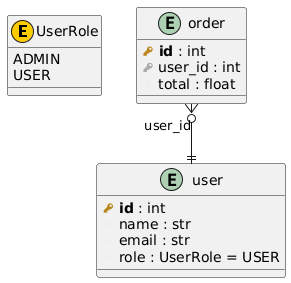
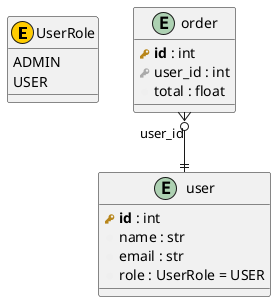

# 🗃️ SQLModel to ERD

[](https://badge.fury.io/py/sqlmodel-to-erd)
[](https://www.python.org/downloads/)
[](https://opensource.org/licenses/MIT)
[](https://github.com/devsuit-berlin/sqlmodel-to-erd/actions)
[](https://github.com/devsuit-berlin/sqlmodel-to-erd/actions)

> 🚀 Generate beautiful PlantUML Entity Relationship Diagrams from your SQLModel/SQLAlchemy models automatically!

**sqlmodel-to-erd** parses your Python model files using AST (Abstract Syntax Tree) and generates comprehensive ERD diagrams in PlantUML format. No database connection required!

## ✨ Features

- 📊 **Automatic ERD Generation** - Parse SQLModel/SQLAlchemy models and generate PlantUML diagrams
- 🔍 **AST-Based Parsing** - No imports needed, works with any valid Python code
- 🎯 **Zero Runtime Dependencies** - Uses only Python standard library
- 🔗 **Relationship Detection** - Automatically detects foreign keys and relationships
- 📦 **Inheritance Support** - Correctly resolves fields from base classes and mixins
- 🏷️ **Enum Support** - Includes enum definitions in the diagram
- 🔄 **Link Table Detection** - Identifies many-to-many relationship tables
- 🎨 **Beautiful Output** - Clean, readable PlantUML with proper styling

## 📦 Installation

### Using pip

```bash
pip install sqlmodel-to-erd
```

### Using uv

```bash
uv add sqlmodel-to-erd
```

### Using pipx (recommended for CLI usage)

```bash
pipx install sqlmodel-to-erd
```

### Using uvx (no installation needed)

```bash
# Run directly without installing
uvx sqlmodel-to-erd ./src/database -o erd.puml
```

## 🚀 Quick Start

### Command Line

```bash
# Generate ERD from a models directory
sqlmodel-erd ./src/database -o erd.puml

# With custom title
sqlmodel-erd ./src/models --title "My Database Schema" -o schema.puml

# Output to stdout
sqlmodel-erd ./src/database
```

### Python API

```python
from pathlib import Path
from sqlmodel_to_erd import parse_models_directory, generate_plantuml

# Parse your models
entities, enums = parse_models_directory(Path("./src/database"))

# Generate PlantUML
diagram = generate_plantuml(
    entities=entities,
    enums=enums,
    title="My Database ERD"
)

# Save or use the diagram
Path("erd.puml").write_text(diagram)
```

## 📖 Usage

### CLI Options

```bash
usage: sqlmodel-erd [-h] [-o OUTPUT] [--title TITLE] [--exclude [EXCLUDE ...]]
                    [--no-enums] [--no-relationships] [-v]
                    input

Generate PlantUML ERD diagrams from SQLModel/SQLAlchemy models

positional arguments:
  input                 Directory containing model files (searches for models.py recursively)

options:
  -h, --help            show this help message and exit
  -o OUTPUT, --output OUTPUT
                        Output .puml file (default: stdout)
  --title TITLE         Diagram title (default: 'Database ERD')
  --exclude [EXCLUDE ...]
                        Patterns to exclude (not yet implemented)
  --no-enums            Skip enum definitions in output
  --no-relationships    Skip relationship lines in output
  -v, --version         show program's version number and exit
```

### Running as Module

```bash
python -m sqlmodel_to_erd ./src/database -o erd.puml
```

### Example Models

Given these SQLModel definitions:

```python
from enum import Enum
from sqlmodel import SQLModel, Field, Relationship

class UserRole(Enum):
    ADMIN = "admin"
    USER = "user"

class User(SQLModel, table=True):
    __tablename__: str = "user"

    id: int = Field(primary_key=True)
    name: str
    email: str = Field(index=True)
    role: UserRole = Field(default=UserRole.USER)

    orders: list["Order"] = Relationship(back_populates="user")

class Order(SQLModel, table=True):
    __tablename__: str = "order"

    id: int = Field(primary_key=True)
    user_id: int = Field(foreign_key="user.id")
    total: float

    user: "User" = Relationship(back_populates="orders")
```

The tool generates:



with following code:



## 🎨 Viewing the Diagram

### Online

1. Copy the generated `.puml` content
2. Paste at [PlantUML Web Server](http://www.plantuml.com/plantuml/uml/)

### Local with PlantUML

```bash
# Install PlantUML (macOS)
brew install plantuml

# Generate PNG
plantuml erd.puml

# Generate SVG
plantuml -tsvg erd.puml
```

### VS Code Extension

Install the [PlantUML extension](https://marketplace.visualstudio.com/items?itemName=jebbs.plantuml) for live preview.

## 🔧 Advanced Usage

### Programmatic Access

```python
from sqlmodel_to_erd import (
    ASTDatabaseParser,
    PlantUMLGenerator,
    EntityInfo,
    FieldInfo,
    EnumInfo,
)

# Low-level parser access
parser = ASTDatabaseParser(Path("./models"))
entities, enums = parser.parse_all_models()

# Access entity details
for name, entity in entities.items():
    print(f"Table: {entity.table_name}")
    for field in entity.fields:
        if field.is_primary_key:
            print(f"  PK: {field.name}")
        elif field.is_foreign_key:
            print(f"  FK: {field.name} -> {field.foreign_table}")

# Custom generator with options
generator = PlantUMLGenerator(
    entities=entities,
    enums=enums,
    title="Custom ERD"
)
output = generator.generate()
```

### Integration with CI/CD

```yaml
# .github/workflows/docs.yml
name: Generate ERD

on:
  push:
    paths:
      - 'src/database/**'

jobs:
  generate-erd:
    runs-on: ubuntu-latest
    steps:
      - uses: actions/checkout@v4

      - name: Set up Python
        uses: actions/setup-python@v5
        with:
          python-version: '3.12'

      - name: Install sqlmodel-to-erd
        run: pip install sqlmodel-to-erd

      - name: Generate ERD
        run: sqlmodel-erd ./src/database --title "Database Schema" -o docs/erd.puml

      - name: Generate PNG
        run: |
          sudo apt-get install -y plantuml
          plantuml docs/erd.puml

      - name: Commit changes
        uses: stefanzweifel/git-auto-commit-action@v5
        with:
          commit_message: "docs: update ERD diagram"
          file_pattern: "docs/erd.*"
```

### Integration with pre-commit hooks

Keep your ERD diagrams automatically updated on every commit using [pre-commit](https://pre-commit.com/):

```yaml
# .pre-commit-config.yaml
repos:
  - repo: local
    hooks:
      - id: generate-erd
        name: 🗃️ Generate ERD Diagram
        entry: sqlmodel-erd ./src/database --title "Database Schema" -o docs/erd.puml
        language: system
        files: ^src/database/.*\.py$
        pass_filenames: false
```

Or using uvx (no installation required):

```yaml
# .pre-commit-config.yaml
repos:
  - repo: local
    hooks:
      - id: generate-erd
        name: 🗃️ Generate ERD Diagram
        entry: uvx sqlmodel-to-erd ./src/database --title "Database Schema" -o docs/erd.puml
        language: system
        files: ^src/database/.*\.py$
        pass_filenames: false
```

**Setup:**

```bash
# Install pre-commit
pip install pre-commit

# Install the hooks
pre-commit install

# Run manually on all files
pre-commit run generate-erd --all-files
```

**How it works:**
- 🔍 Only triggers when files in `src/database/` change
- 📝 Automatically regenerates `docs/erd.puml`
- ✅ Stages the updated diagram with your commit
- 🚫 Fails if the diagram would change (ensuring docs stay in sync)

**Tip:** Add `docs/erd.puml` to your staged files before committing, or use the `--all-files` flag to regenerate.

## 📋 Supported Features

| Feature | Status | Notes |
| -------- | -------- | ------- |
| Primary Keys | ✅ | `Field(primary_key=True)` |
| Foreign Keys | ✅ | `Field(foreign_key="table.column")` |
| Nullable Fields | ✅ | `str \| None` or `Optional[str]` |
| Default Values | ✅ | `Field(default=value)` |
| Indexes | ✅ | `Field(index=True)` |
| Enums | ✅ | Python `Enum` classes |
| Relationships | ✅ | `Relationship()` |
| Inheritance | ✅ | Mixin classes supported |
| Link Tables | ✅ | Many-to-many detection |
| Custom Table Names | ✅ | `__tablename__` attribute |

## 🤝 Contributing

Contributions are welcome! Please see [CONTRIBUTING.md](CONTRIBUTING.md) for guidelines.

## 🔒 Security

For security concerns, please see [SECURITY.md](SECURITY.md).

## 📄 License

This project is licensed under the MIT License - see the [LICENSE](LICENSE) file for details.

## 🙏 Acknowledgments

- [SQLModel](https://sqlmodel.tiangolo.com/) - The awesome SQL database library
- [PlantUML](https://plantuml.com/) - For the diagram rendering
- [SQLAlchemy](https://www.sqlalchemy.org/) - The powerful ORM that SQLModel builds on

---

Made with ❤️ by [Devsuit GmbH](https://github.com/devsuit-berlin)
