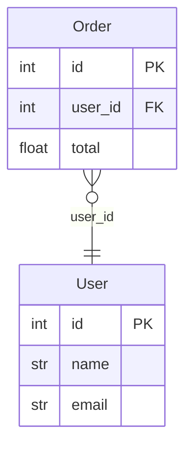

# 🗃️ erdify

[](https://pypi.org/project/erdify/)
[](https://pypi.org/project/erdify/)
[](https://opensource.org/licenses/MIT)
[](https://github.com/devsuit-berlin/erdify/actions/workflows/test.yml)
[](https://github.com/devsuit-berlin/erdify/actions/workflows/test.yml)
[](https://erdify.devsuit.io/)

> 🚀 Generate beautiful PlantUML Entity Relationship Diagrams from your SQLModel, SQLAlchemy, Django, Pydantic and dataclass models automatically!

**erdify** parses your model files using AST (Abstract Syntax Tree) and generates comprehensive ERD diagrams in PlantUML format. It supports SQLModel, SQLAlchemy 2.0, Django ORM, Pydantic and standard-library dataclasses — and raw SQL DDL files (`.sql`) via the optional `erdify[sql]` extra. No database connection required!

## ✨ Features

- 🧬 **5 Python Frameworks + SQL DDL** - SQLModel, SQLAlchemy 2.0, Django ORM, Pydantic, dataclasses, and raw `.sql` files (via [`erdify[sql]`](https://erdify.devsuit.io/frameworks/sql/))
- 🔍 **AST-Based Parsing** - No imports needed, works with any valid Python code
- 🎯 **Zero dependencies by default** — core uses only the stdlib; SQL support is an opt-in extra (`erdify[sql]`)
- 🔗 **Relationship Detection** - Foreign keys, relationships and many-to-many link tables
- 🧜 **4 Output Formats** - `--format` emits PlantUML, Mermaid (renders natively on GitHub), JSON, or a self-contained HTML preview
- 📝 **Markdown Embed** - `--inject` writes the diagram into a Markdown file between markers
- ⚙️ **Config File** - Store options under `[tool.erdify]` in `pyproject.toml`
- ✅ **Drift Check** - `--check` fails CI/pre-commit when the committed diagram is stale

See the [full feature matrix](https://erdify.devsuit.io/features/) for everything erdify recognizes.

## 🤔 Why erdify and not X?

| | **erdify** | paracelsus | eralchemy | sqlalchemy-schemadisplay | erdantic | `graph_models` | DBML/dbdiagram |
|---|---|---|---|---|---|---|---|
| Needs a live DB connection | **No** | No | Optional | Optional | No | No | Only for `db2dbml` |
| Imports/executes your code | **No** | Yes | Yes | Yes | Yes | Yes (full Django setup) | n/a |
| Frameworks read | **5 + SQL DDL** | SQLAlchemy | SQLAlchemy | SQLAlchemy | Pydantic, attrs, msgspec, dataclasses | Django | SQL dumps |
| Runtime dependencies | **None** | SQLAlchemy, pydot, typer | SQLAlchemy + Graphviz | SQLAlchemy, pydot, Graphviz | pydantic, pygraphviz, … | Django + Graphviz | Node.js |
| CI drift gate | **`--check`** | `--check` | No | No | No | No | No |

erdify reads your source with the stdlib `ast` module, so it runs in a docs
pipeline, a pre-commit hook or a CI job against a repository it cannot even
install — and one command covers five frameworks plus raw SQL, where every
other tool here covers one. That is a trade-off, not a free win: anything your
code builds at runtime is invisible to it, and none of these tools renders
images for you.

👉 **[Full comparison, including when to use something else](https://erdify.devsuit.io/comparison/)**

## 🚀 Quick Start

```bash
# Run without installing (or `pip install erdify`)
uvx erdify ./src/database -o erd.puml
```

```bash
# Output to stdout, with a custom title
erdify ./src/models --title "My Database Schema"
```

See the [documentation](https://erdify.devsuit.io/) for installation options, the full CLI, the Python API and more.

## 🧬 One Schema, Five Frameworks

The same `User` / `Order` schema in **SQLModel, SQLAlchemy 2.0, Django, Pydantic
and dataclasses** — only the syntax differs. Each one produces the **identical**
diagram:

`erdify docs/examples/sqlmodel --inject README.md` keeps the diagram below in
this file. It is Mermaid, so GitHub renders it directly — and a pre-commit hook
runs the same command with `--check`, so it cannot go stale:

<!-- erdify:start -->

```mermaid
erDiagram
    User {
        int id PK
        str name
        str email
    }
    Order {
        int id PK
        int user_id FK
        float total
    }
    Order }o--|| User : "user_id"
```
<!-- erdify:end -->

👉 **See the full side-by-side comparison and the detection/parsing table in the
[Frameworks Overview](https://erdify.devsuit.io/frameworks/)** (with a worked
example and [Django specifics](https://erdify.devsuit.io/frameworks/django/)).
The runnable sources live in [`docs/examples/`](https://github.com/devsuit-berlin/erdify/tree/main/docs/examples).

## 📚 Documentation

- [Installation](https://erdify.devsuit.io/installation/) — pip, uv, pipx, or run with uvx
- [CLI & Python API](https://erdify.devsuit.io/usage/cli/) — all CLI options, running as a module, and the Python API
- [Output Formats](https://erdify.devsuit.io/usage/output-formats/) — PlantUML & Mermaid, `--format`, `--inject` into Markdown, output naming
- [Filtering & Key Inference](https://erdify.devsuit.io/usage/filtering/) — `--exclude`, `--exclude-paths`, `--include`, `--sources`, `--infer-keys`
- [Viewing the Diagram](https://erdify.devsuit.io/usage/viewing/) — render online, locally with PlantUML, or in VS Code
- [CI/CD & pre-commit](https://erdify.devsuit.io/usage/ci/) — automate ERD generation in CI and on commit
- [Frameworks Overview](https://erdify.devsuit.io/frameworks/) — a worked example with the generated PlantUML output
- [Django ORM](https://erdify.devsuit.io/frameworks/django/) — Django-specific parsing details
- [SQL DDL](https://erdify.devsuit.io/frameworks/sql/) — generate ERDs from `.sql` files with `erdify[sql]`
- [Comparison](https://erdify.devsuit.io/comparison/) — erdify next to the other ERD generators
- [Troubleshooting](https://erdify.devsuit.io/troubleshooting/) — symptom-first fixes for the common surprises

## 📋 Supported Features

Primary/foreign keys, nullable fields, defaults, indexes, enums, relationships,
inheritance, link tables, custom table names and per-framework specifics — see
the **[full feature matrix](https://erdify.devsuit.io/features/)** in the docs.

## 💬 Community

Questions, ideas, or want to show off an ERD erdify generated? Join the
[**Discussions**](https://github.com/devsuit-berlin/erdify/discussions). For
open-ended topics and feature direction, Discussions are the place; concrete
bugs and proposals go to [Issues](https://github.com/devsuit-berlin/erdify/issues).

## 🤝 Contributing

Contributions are welcome! Have a bug or a concrete feature request? Please
[open an issue](https://github.com/devsuit-berlin/erdify/issues), and see
[CONTRIBUTING.md](https://github.com/devsuit-berlin/erdify/blob/main/CONTRIBUTING.md)
for guidelines. Shipped changes are tracked in the
[changelog](https://github.com/devsuit-berlin/erdify/blob/main/CHANGELOG.md).

## 🔒 Security

For security concerns, please see [SECURITY.md](https://github.com/devsuit-berlin/erdify/blob/main/SECURITY.md).

## 📄 License

This project is licensed under the MIT License - see the [LICENSE](https://github.com/devsuit-berlin/erdify/blob/main/LICENSE) file for details.

## 🙏 Acknowledgments

erdify stands on the shoulders of great open-source projects:

**Supported model frameworks**

- [SQLModel](https://sqlmodel.tiangolo.com/) - The awesome SQL database library
- [SQLAlchemy](https://www.sqlalchemy.org/) - The Python SQL toolkit and ORM
- [Django](https://www.djangoproject.com/) - The web framework whose ORM models erdify parses
- [Pydantic](https://docs.pydantic.dev/) - Data validation using Python type hints
- [dataclasses](https://docs.python.org/3/library/dataclasses.html) - Python standard-library data classes

**Rendering & output**

- [PlantUML](https://plantuml.com/) - For the diagram rendering
- [Graphviz](https://graphviz.org/) - Layout engine behind PlantUML's ER diagrams
- [Mermaid](https://mermaid.js.org/) - Renders the `--format mermaid` / `html` output

**Tooling & infrastructure**

- [uv](https://docs.astral.sh/uv/) - Packaging, builds and dependency management
- [Ruff](https://docs.astral.sh/ruff/) - Linting and formatting
- [mypy](https://mypy-lang.org/) - Static type checking
- [pytest](https://docs.pytest.org/) - Testing framework
- [pre-commit](https://pre-commit.com/) - Git hook management

**Community**

- [Contributor Covenant](https://www.contributor-covenant.org/) - Our Code of Conduct
- [Keep a Changelog](https://keepachangelog.com/) - Changelog format
- And everyone who [contributes](https://github.com/devsuit-berlin/erdify/blob/main/CONTRIBUTING.md) issues, ideas and pull requests 💜

---

Created &amp; maintained with ❤️ by [devsuit GmbH](https://devsuit.de)
