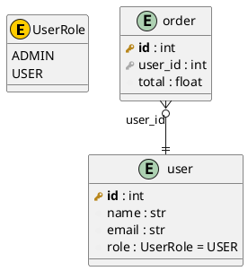

# Frameworks Overview

erdify recognizes five model frameworks from source and renders them into the
same ERD format. For the side-by-side framework comparison and the
detection/parsing table, see the [main README](../../README.md#-one-schema-five-frameworks).
This page shows a worked example with the generated PlantUML output; for
Django-specific details see [Django ORM](django.md).

## Example Models

Given these SQLModel definitions:

```python
from enum import Enum
from sqlmodel import SQLModel, Field, Relationship

class UserRole(Enum):
    ADMIN = "admin"
    USER = "user"

class User(SQLModel, table=True):
    __tablename__: str = "user"

    id: int = Field(primary_key=True)
    name: str
    email: str = Field(index=True)
    role: UserRole = Field(default=UserRole.USER)

    orders: list["Order"] = Relationship(back_populates="user")

class Order(SQLModel, table=True):
    __tablename__: str = "order"

    id: int = Field(primary_key=True)
    user_id: int = Field(foreign_key="user.id")
    total: float

    user: "User" = Relationship(back_populates="orders")
```

The tool generates:


with following code:


