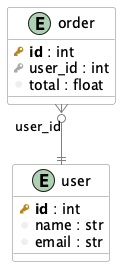
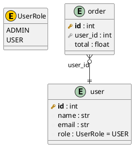

# Frameworks Overview

erdify recognizes five model frameworks from source and renders them into the
same ERD format. This page shows the five frameworks side by side, how each is
detected, and a worked example with the generated PlantUML. For Django-specific
parsing details see [Django ORM](django.md).

## One Schema, Five Frameworks

The snippets below all describe the **same** `User` / `Order` schema — only the
syntax differs. Each one produces the **identical** diagram:



!!! info

    The SQLModel, SQLAlchemy and Django versions declare keys explicitly (Django
    via its implicit `id` and `ForeignKey`). Pydantic and dataclasses have no key
    concept, so they are rendered with [`--infer-keys`](../usage/filtering.md)
    (`id` → PK, `<x>_id` → FK) to match. The runnable sources live in
    [`docs/examples/`](https://github.com/devsuit-berlin/erdify/tree/main/docs/examples).

<table>
<tr><th>SQLModel</th><th>SQLAlchemy 2.0</th></tr>
<tr><td markdown="1">

```python
from sqlmodel import (
    Field, Relationship, SQLModel,
)


class User(SQLModel, table=True):
    __tablename__: str = "user"
    id: int = Field(primary_key=True)
    name: str
    email: str
    orders: list["Order"] = Relationship(
        back_populates="user")


class Order(SQLModel, table=True):
    __tablename__: str = "order"
    id: int = Field(primary_key=True)
    user_id: int = Field(
        foreign_key="user.id")
    total: float
    user: "User" = Relationship(
        back_populates="orders")
```

</td><td markdown="1">

```python
from sqlalchemy import ForeignKey
from sqlalchemy.orm import (
    DeclarativeBase, Mapped,
    mapped_column, relationship,
)


class Base(DeclarativeBase): ...


class User(Base):
    __tablename__ = "user"
    id: Mapped[int] = mapped_column(
        primary_key=True)
    name: Mapped[str] = mapped_column()
    email: Mapped[str] = mapped_column()
    orders: Mapped[list["Order"]] = (
        relationship(back_populates="user"))


class Order(Base):
    __tablename__ = "order"
    id: Mapped[int] = mapped_column(
        primary_key=True)
    user_id: Mapped[int] = mapped_column(
        ForeignKey("user.id"))
    total: Mapped[float] = mapped_column()
    user: Mapped["User"] = relationship(
        back_populates="orders")
```

</td></tr>
<tr><th>Pydantic <code>--infer-keys</code></th><th>Dataclass <code>--infer-keys</code></th></tr>
<tr><td markdown="1">

```python
from pydantic import BaseModel


class User(BaseModel):
    id: int
    name: str
    email: str
    orders: list["Order"] = []


class Order(BaseModel):
    id: int
    user_id: int
    total: float
    user: "User"
```

</td><td markdown="1">

```python
from dataclasses import dataclass, field


@dataclass
class User:
    id: int
    name: str
    email: str
    orders: list["Order"] = field(
        default_factory=list)


@dataclass
class Order:
    id: int
    user_id: int
    total: float
    user: "User" = None
```

</td></tr>
<tr><th colspan="2">Django ORM</th></tr>
<tr><td colspan="2" markdown="1">

```python
from django.db import models


class User(models.Model):       # implicit `id` PK; CharField/EmailField -> str
    name = models.CharField(max_length=100)
    email = models.EmailField()

    class Meta:
        db_table = "user"


class Order(models.Model):
    user = models.ForeignKey(    # -> user_id : int foreign key column
        User, on_delete=models.CASCADE)
    total = models.FloatField()  # -> float

    class Meta:
        db_table = "order"
```

</td></tr>
</table>

### How each framework is detected & parsed

| Framework | Detected by | Keys | Relationships |
| --------- | ----------- | ---- | ------------- |
| SQLModel | `table=True` | `Field(primary_key=…, foreign_key=…)` | `Relationship()` |
| SQLAlchemy 2.0 | `__tablename__` + `Mapped[...]` columns | `mapped_column(primary_key=…)`, `ForeignKey(...)` | `relationship()` (lowercase) |
| Django ORM | `models.Model` subclass | `primary_key=True` or implicit `id`, `ForeignKey`/`OneToOneField` | `ForeignKey` (N:1), `OneToOneField` (1:1), `ManyToManyField` (M:N, incl. `through=`) |
| Pydantic | `BaseModel` subclass (incl. transitive) | `--infer-keys` only | nested model refs (`user: User`, `list["Order"]`) |
| Dataclass | `@dataclass` decorator | `--infer-keys` only | nested model refs |

!!! info

    Mixins / abstract bases (e.g. a SQLAlchemy mixin without `__tablename__`, or a
    Django `class Meta: abstract = True` base) are not drawn as tables, but their
    columns are inherited into concrete entities.

## Worked example

Given these SQLModel definitions:

```python
from enum import Enum
from sqlmodel import SQLModel, Field, Relationship

class UserRole(Enum):
    ADMIN = "admin"
    USER = "user"

class User(SQLModel, table=True):
    __tablename__: str = "user"

    id: int = Field(primary_key=True)
    name: str
    email: str = Field(index=True)
    role: UserRole = Field(default=UserRole.USER)

    orders: list["Order"] = Relationship(back_populates="user")

class Order(SQLModel, table=True):
    __tablename__: str = "order"

    id: int = Field(primary_key=True)
    user_id: int = Field(foreign_key="user.id")
    total: float

    user: "User" = Relationship(back_populates="orders")
```

The tool generates:


with following code:


