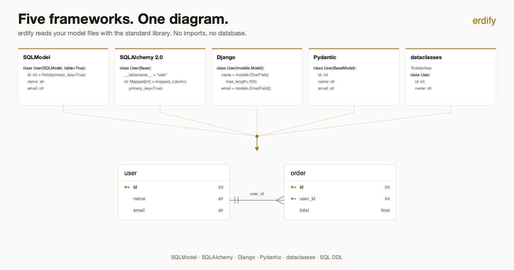

# erdify

**One ERD generator for every Python schema in your repository — parsed from
source, with no imports, no database connection and no runtime dependencies.**



The same two tables, written in SQLModel, SQLAlchemy 2.0, Django, Pydantic and
dataclasses, all render to the same diagram.

## Install and run

```bash
uvx erdify ./src/database -o docs/erd.puml        # no install
pip install erdify                                 # or install it
erdify ./src/database --format mermaid -o docs/erd.mmd
```

That is the whole tool: point it at a directory, get PlantUML, Mermaid, JSON or
a self-contained HTML page. `--inject` writes the diagram straight into a
Markdown file, and `--check` fails your build when it drifts out of date.

## Why erdify?

erdify reads your source with the standard library's `ast` module. It never
imports your code and never opens a connection, so it runs in a docs pipeline, a
pre-commit hook or a CI job against a repository it cannot even install — and it
covers five frameworks plus raw SQL DDL with one command.

→ **[How it compares to eralchemy, erdantic, graph_models and DBML](comparison.md)**,
including where each of those is the better choice.

## Contents

- [Installation](installation.md) — install via pip, uv, pipx or run with uvx
- [Quickstart](quickstart.md) — the handful of commands you'll use most, with links to the details
- [Features](features.md) — the full matrix of what erdify recognizes when parsing your models
- [Comparison](comparison.md) — erdify next to the other ERD generators
- [CLI & Python API](usage/cli.md) — command-line options, running as a module, and the Python API (incl. programmatic access)
- [Output Formats](usage/output-formats.md) — PlantUML and Mermaid, `--format`, output naming
- [Filtering & Key Inference](usage/filtering.md) — `--exclude`, `--exclude-paths`, `--sources`, and `--infer-keys`
- [Viewing the Diagram](usage/viewing.md) — render online, locally with PlantUML, or in VS Code
- [CI/CD & pre-commit](usage/ci.md) — keep ERDs up to date in CI and via pre-commit hooks
- [Frameworks Overview](frameworks/index.md) — the five frameworks side by side, how each is detected, and a worked example with the generated PlantUML
- [Django ORM](frameworks/django.md) — Django-specific parsing details (FK mapping, type mapping, enums, abstract bases, `db_table`)
- [SQL DDL](frameworks/sql.md) — generate ERDs from `.sql` files via the optional `erdify[sql]` extra (`CREATE TABLE`, foreign keys, enums)
- [Python Parsing Limitations](frameworks/limitations.md) — what the AST parser cannot see, and what to do instead
- [Troubleshooting](troubleshooting.md) — symptom-first fixes for the common surprises
