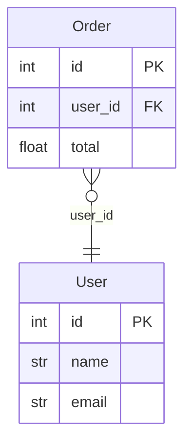

# Output Formats

erdify renders to **PlantUML** (`.puml`, the default) and **Mermaid**
(`.mmd`). Choose one or both with `--format`.

```bash
erdify ./src/database --format mermaid -o docs/erd.mmd
erdify ./src/database --format plantuml mermaid -o docs/erd   # writes both
```

## How `--output` and extensions work

The extension of `-o` is **normalized to match the format**: erdify strips any
existing suffix and appends `.puml` (PlantUML) or `.mmd` (Mermaid). So
`-o docs/erd`, `-o docs/erd.puml` and `-o docs/erd.txt` all produce
`docs/erd.puml` for PlantUML.

- One format, no `-o` → printed to stdout.
- Multiple formats → require `-o`; each is written to `<base>.<ext>`.
- `--check` validates **every** target file and exits non-zero if any is missing
  or stale.

Set a default in `pyproject.toml`:

```toml
[tool.erdify]
format = ["plantuml", "mermaid"]
output = "docs/erd"
```

## Mermaid

Mermaid `erDiagram` output renders natively on GitHub and GitLab, so you can
embed an ERD directly in Markdown without a PlantUML/Graphviz toolchain:



Notes:

- Relationships use crow's-foot cardinalities identical to PlantUML
  (`}o--||` N:1, `||--o{` 1:N, `||--||` 1:1, `}o--o{` M:N).
- Mermaid has no enum construct, so each used enum is rendered as an entity block
  listing its values; the referencing column keeps the enum name as its type.
- Attribute types are reduced to a single Mermaid-safe token (e.g. `list[str]`
  becomes `list_str`).
