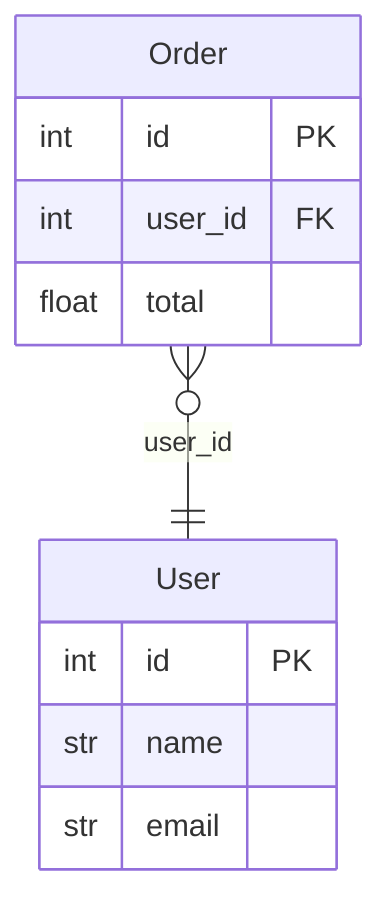

# Output Formats

erdify renders to four formats, chosen (one or more) with `--format`:

| Format | Extension | What it is |
| ------ | --------- | ---------- |
| `plantuml` (default) | `.puml` | PlantUML ERD source |
| `mermaid` | `.mmd` | Mermaid `erDiagram` source (renders natively on GitHub/GitLab) |
| `json` | `.json` | The parsed model as structured JSON, for downstream tools |
| `html` | `.html` | A self-contained page that draws the ERD with Mermaid |

```bash
erdify ./src/database --format mermaid -o docs/erd.mmd
erdify ./src/database --format plantuml mermaid -o docs/erd   # writes both
```

## How `--output` and extensions work

The extension of `-o` is **normalized to match the format**: erdify strips any
existing suffix and appends the format's extension (`.puml`, `.mmd`, `.json`,
`.html`). So `-o docs/erd`, `-o docs/erd.puml` and `-o docs/erd.txt` all produce
`docs/erd.puml` for PlantUML.

- One format, no `-o` → printed to stdout.
- Multiple formats → require `-o`; each is written to `<base>.<ext>`.
- `--check` validates **every** target file and exits non-zero if any is missing
  or stale.

Set a default in `pyproject.toml`:

```toml
[tool.erdify]
format = ["plantuml", "mermaid"]
output = "docs/erd"
```

## Mermaid

Mermaid `erDiagram` output renders natively on GitHub and GitLab, so you can
embed an ERD directly in Markdown without a PlantUML/Graphviz toolchain:



Notes:

- Relationships use crow's-foot cardinalities identical to PlantUML
  (`}o--||` N:1, `||--o{` 1:N, `||--||` 1:1, `}o--o{` M:N).
- Mermaid has no enum construct, so each used enum is rendered as an entity block
  listing its values; the referencing column keeps the enum name as its type.
- Attribute types are reduced to a single Mermaid-safe token (e.g. `list[str]`
  becomes `list_str`).

## JSON

`--format json` emits the parsed model as structured JSON — the integration
point for downstream tools that want erdify's model without re-parsing source.

```json
{
  "title": "Database ERD",
  "entities": [
    {
      "name": "Order",
      "table_name": "order",
      "source": "sqlmodel",
      "is_link_table": false,
      "fields": [
        {"name": "id", "type": "int", "primary_key": true, "foreign_key": false,
         "nullable": false, "foreign_table": null, "index": false, "default": null}
      ],
      "relationships": [{"target": "User", "type": "one", "attribute": "user"}]
    }
  ],
  "enums": [{"name": "Status", "values": ["DRAFT", "PUBLISHED"]}]
}
```

## HTML

`--format html` wraps the Mermaid diagram in a self-contained HTML page — open it
in a browser to view the ERD (double-click). It loads Mermaid from a **pinned
CDN** version, so it needs internet access to render. For offline/raster export,
render the `.mmd` with [`@mermaid-js/mermaid-cli`](https://github.com/mermaid-js/mermaid-cli)
or the `.puml` with PlantUML.
